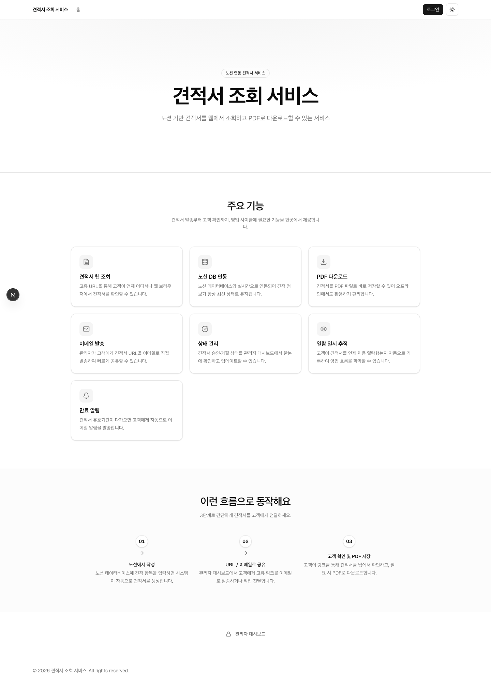
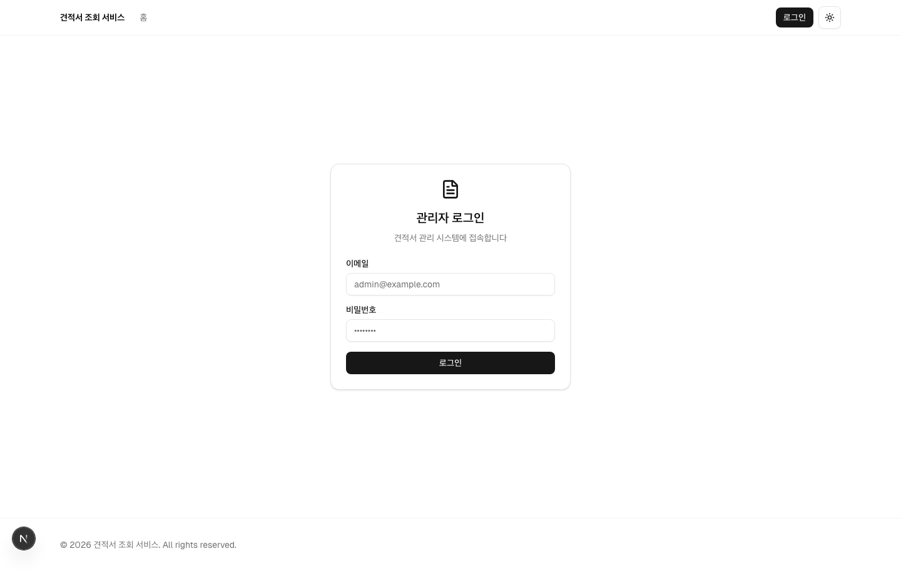
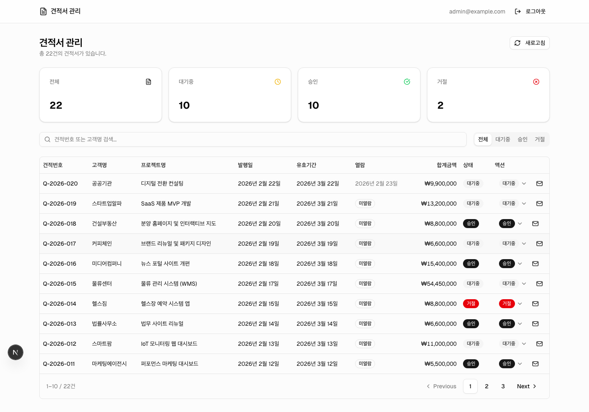
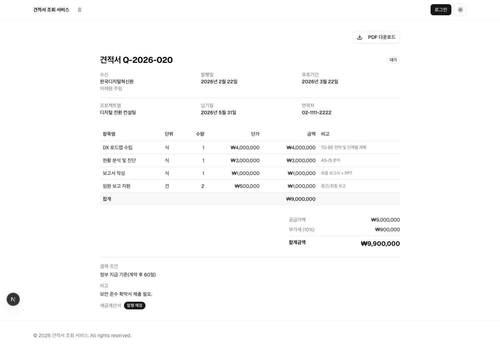
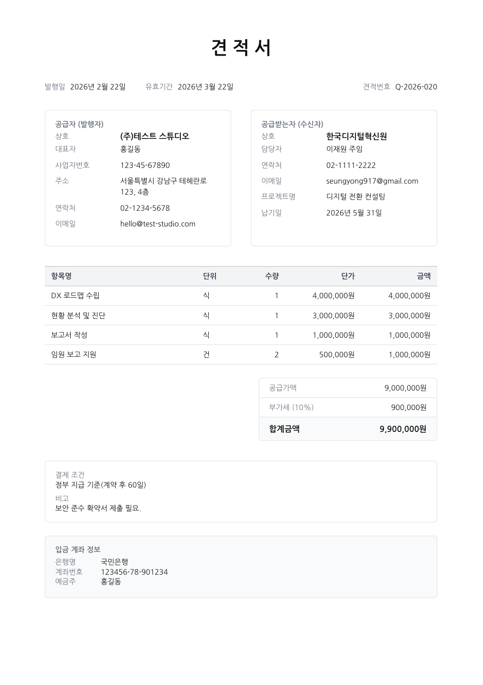

# 견적서 조회 서비스

노션 데이터베이스를 백엔드로 활용하는 견적서 웹 서비스입니다.
고유 URL로 견적서를 조회하고, PDF로 다운로드하며, 관리자가 상태를 관리하고 이메일로 발송할 수 있습니다.

## 스크린샷

| 메인페이지 | 로그인 |
|:---:|:---:|
|  |  |

| 관리자 대시보드 | 견적서 상세 |
|:---:|:---:|
|  |  |

| 견적서 PDF |
|:---:|
|  |

## 주요 기능

- **견적서 웹 조회**: 고유 URL(`/invoice/[id]`)로 고객이 웹에서 견적서 열람
- **PDF 다운로드**: `@react-pdf/renderer` 기반 PDF 생성 및 다운로드
- **노션 실시간 연동**: 노션 API로 데이터 조회 및 상태 변경
- **이메일 발송**: Resend를 통해 고객에게 견적서 URL 이메일 발송
- **만료 알림**: 유효기간 D-3, D-1에 자동 이메일 알림 (Vercel Cron)
- **열람 일시 추적**: 고객이 최초 열람 시 일시를 노션에 자동 기록
- **관리자 대시보드**: 전체 견적서 목록 조회, 상태별 통계, 검색/필터, 페이지네이션
- **상태 관리**: 견적서 승인·거절 상태를 대시보드에서 변경
- **인증**: NextAuth.js v5 Credentials Provider (단일 관리자 계정)
- **다크모드**: `next-themes` 기반 라이트/다크 테마 전환

## 기술 스택

| 분류 | 사용 기술 |
|------|-----------|
| 프레임워크 | Next.js 16 (App Router) |
| 언어 | TypeScript |
| 스타일링 | TailwindCSS v4, shadcn/ui (New York) |
| 데이터베이스 | Notion API (`@notionhq/client`) |
| 인증 | NextAuth.js v5 (Credentials + JWT) |
| PDF | `@react-pdf/renderer` |
| 이메일 | Resend + `@react-email/render` |
| 폰트 | Noto Sans KR |

## 프로젝트 구조

```
src/
  app/
    (public)/             # 공개 레이아웃 (Header + Footer)
      page.tsx            # 홈 (서비스 소개)
      invoice/[id]/       # 견적서 조회 페이지
      login/              # 관리자 로그인
    (admin)/              # 관리자 레이아웃 (AdminHeader)
      admin/              # 관리자 대시보드
    api/
      invoice/[id]/           # 견적서 단건 조회 API
      invoice/[id]/pdf/       # PDF 렌더링 API
      invoice/[id]/view/      # 열람 일시 기록 API
      admin/invoice/[id]/status/      # 상태 변경 API (인증 필요)
      admin/invoice/[id]/send-email/  # 이메일 발송 API (인증 필요)
      cron/expiry-reminder/           # 만료 알림 Cron API
    layout.tsx            # 루트 레이아웃 (Providers만)
  middleware.ts           # /admin 경로 인증 미들웨어

components/
  admin/                  # 관리자 전용 컴포넌트
  invoice/                # 견적서 뷰 컴포넌트
  email/                  # 이메일 템플릿 컴포넌트
  layout/                 # Header, Footer, MobileNav, ThemeToggle
  common/                 # PageHeader, LoadingSpinner
  ui/                     # shadcn/ui 컴포넌트

lib/
  notion.ts               # 노션 API 헬퍼 (조회/목록/상태변경/열람기록)
  email.ts                # Resend 이메일 발송 헬퍼
  constants.ts            # SITE_CONFIG, NAV_ITEMS
  utils.ts                # cn() 유틸리티
  helpers.ts              # 문자열/날짜/숫자 유틸리티

types/
  invoice.ts              # Invoice, InvoiceItem, Sender 타입
  index.ts                # 공통 타입

auth.ts                   # NextAuth.js v5 설정 (루트)
```

## 환경 변수 설정

`.env.example`을 복사해 `.env.local`을 만들고 값을 채웁니다.

```bash
cp .env.example .env.local
```

| 변수명 | 필수 | 설명 |
|--------|:----:|------|
| `NOTION_API_KEY` | ✅ | 노션 Integration 시크릿 키 |
| `NOTION_QUOTE_DB_ID` | ✅ | 견적서 메인 데이터베이스 ID |
| `NOTION_QUOTE_ITEM_DB_ID` | ✅ | 견적 항목 데이터베이스 ID |
| `NOTION_SENDER_DB_ID` | ✅ | 발행자 정보 데이터베이스 ID |
| `NEXT_PUBLIC_APP_URL` | ✅ | 앱 기본 URL (예: `http://localhost:3000`) |
| `AUTH_SECRET` | ✅ | NextAuth 세션 암호화 키 (32자 이상) |
| `ADMIN_EMAIL` | ✅ | 관리자 이메일 |
| `ADMIN_PASSWORD_HASH` | ✅ | 관리자 비밀번호 bcrypt 해시 |
| `RESEND_API_KEY` | ✅ | Resend API 키 (이메일 발송) |
| `EMAIL_FROM` | ✅ | 발신자 이메일 (Resend 인증 도메인) |
| `CRON_SECRET` | ✅ | Cron API 인증 시크릿 (임의 문자열) |

### 관리자 비밀번호 해시 생성

```bash
node -e "const b=require('bcryptjs'); console.log(b.hashSync('your-password', 12))"
```

> `.env.local`에 저장할 때 `$` 기호는 `\$`로 이스케이프해야 합니다.
> ```
> ADMIN_PASSWORD_HASH=\$2b\$12\$...
> ```

### AUTH_SECRET 생성

```bash
openssl rand -base64 32
```

## 개발 명령어

```bash
npm run dev     # 개발 서버 실행 (http://localhost:3000)
npm run build   # 프로덕션 빌드
npm run start   # 프로덕션 서버 실행
npm run lint    # ESLint 실행
```

## 노션 데이터베이스 구조

### 견적서 DB (`NOTION_QUOTE_DB_ID`)

| 프로퍼티 | 타입 | 설명 |
|----------|------|------|
| 이름 | title | 견적서 번호 (예: Q-2025-001) |
| 고객명 | rich_text | 수신 고객명 또는 담당자명 |
| 고객 회사명 | rich_text | 수신 회사명 |
| 고객 담당자명 | rich_text | 담당자명 |
| 발행일 | date | 견적서 발행일 |
| 유효기간 | date | 견적 유효기간 만료일 |
| 납기일 | date | 납품 예정일 |
| 합계금액 | number | 총 견적 금액 (부가세 포함) |
| 공급가액 | number | 부가세 제외 금액 |
| 상태 | select | `pending` / `approved` / `rejected` |
| 클라이언트 이메일 | email | 이메일 발송 및 만료 알림 대상 |
| 클라이언트 연락처 | phone_number | 고객 연락처 |
| 프로젝트명 | rich_text | 프로젝트 또는 업무 명칭 |
| 결제 조건 | rich_text | 결제 방식 및 조건 |
| 비고 | rich_text | 기타 안내 사항 |
| 세금계산서 발행 여부 | checkbox | 세금계산서 발행 예정 여부 |
| 열람일시 | date | 고객 최초 열람 시 자동 기록 |

### 견적 항목 DB (`NOTION_QUOTE_ITEM_DB_ID`)

| 프로퍼티 | 타입 | 설명 |
|----------|------|------|
| 이름 | title | 항목 설명 |
| 수량 | number | 수량 |
| 단가 | number | 단가 |
| 공급가액 | formula | 수량 × 단가 |
| 단위 | select | 단위 (식, 건, 개 등) |
| 카테고리 | select | 항목 분류 |
| 비고 | rich_text | 항목 메모 |
| 견적서 | relation | 견적서 DB와 연결 |

### 발행자 정보 DB (`NOTION_SENDER_DB_ID`)

| 프로퍼티 | 타입 |
|----------|------|
| 회사명, 대표자명, 사업자등록번호 | rich_text |
| 주소, 전화번호, 계좌번호, 은행명, 예금주 | rich_text |
| 이메일 | email |

## 주요 라우트

| 경로 | 설명 |
|------|------|
| `/` | 서비스 소개 홈 |
| `/invoice/[id]` | 견적서 조회 (노션 페이지 ID) |
| `/login` | 관리자 로그인 |
| `/admin` | 관리자 대시보드 (인증 필요) |
| `/api/invoice/[id]/pdf` | PDF 다운로드 |
| `/api/admin/invoice/[id]/status` | 상태 변경 (인증 필요) |
| `/api/admin/invoice/[id]/send-email` | 이메일 발송 (인증 필요) |
| `/api/cron/expiry-reminder` | 만료 알림 Cron (Bearer 인증) |

## Vercel 배포 시 Cron 설정

`vercel.json`에 아래 내용을 추가해 매일 자정 만료 알림이 실행되도록 설정합니다.

```json
{
  "crons": [
    {
      "path": "/api/cron/expiry-reminder",
      "schedule": "0 15 * * *"
    }
  ]
}
```

> `0 15 * * *`는 UTC 15:00 = KST 00:00 (자정)입니다.
> Vercel Hobby 플랜은 하루 1개 Cron만 허용되므로 D-3, D-1을 단일 핸들러에서 처리합니다.

## shadcn/ui 컴포넌트 추가

```bash
npx shadcn@latest add <component-name>
```
